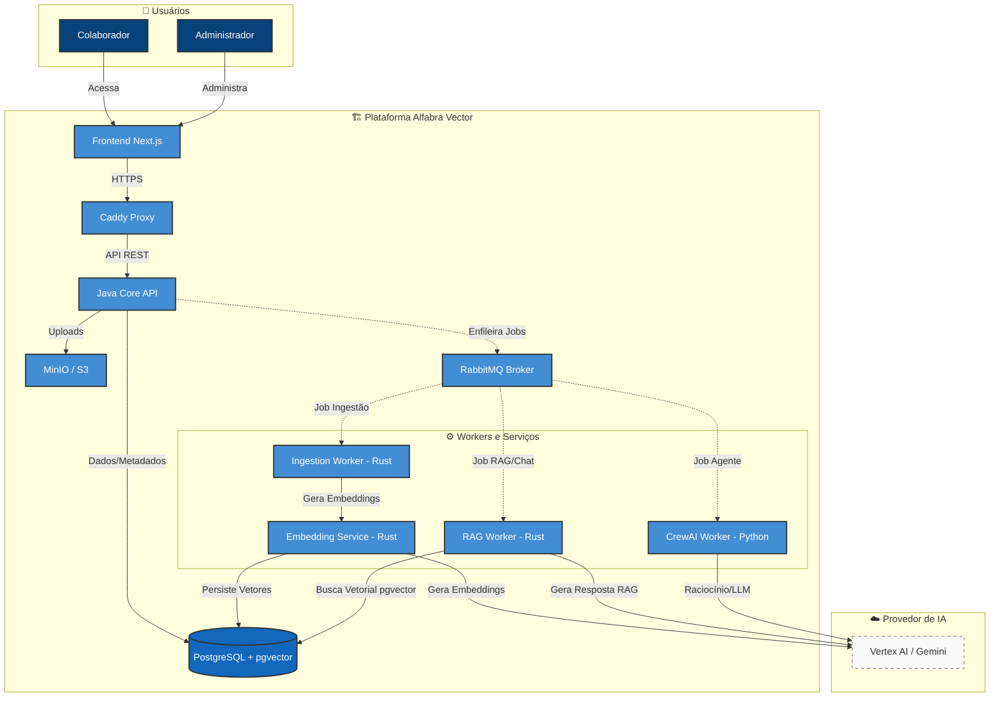

# Delphos

Uma plataforma corporativa modular para orquestração de agentes de IA com Recuperação Aumentada por Geração (RAG).

## 🏗️ Arquitetura do Sistema

A arquitetura foi concebida seguindo os princípios de **Clean Architecture** e **Baixo Acoplamento**, facilitando a transição futura para microserviços se necessário.

### Visão Geral da Arquitetura (Mermaid)


## 📂 Estrutura de Diretórios

A organização do código segue um padrão modular:

- **`frontend/`**: Interface web moderna construída com Next.js 15, React e TypeScript.
- **`java-core/`**: API principal desenvolvida em Java 21 com Spring Boot. Implementa as regras de negócio e a autenticação/RBAC do sistema.
- **`rust-services/`**: Serviços de alta performance em Rust para processamento pesado de documentos, geração de embeddings e processamento de RAG.
- **`python-services/`**: Serviços em Python contendo o container do `crew-worker` para orquestração de agentes.
- **`infrastructure/`**: Configurações de Docker, Caddy, monitoramento e scripts de ambiente.
- **`docs/`**: Documentação técnica detalhada, incluindo ADRs (Architectural Decision Records) e o [fluxo de deploy no Cloud Run](docs/deploy-cloud-run.md).

## 🚀 Destaques Tecnológicos

- **Frontend**: Next.js (App Router), Tailwind CSS, Shadcn UI, TanStack Query, Framer Motion.
- **Backend Core**: Java 21, Spring Boot, Spring Security (JWT), PostgreSQL + pgvector.
- **Processamento**: Rust para processamento paralelo e eficiente de dados.
- **IA**: Integração com Google Vertex AI / Gemini 2.5 Pro para geração de texto e embeddings, com fallback para Google AI Studio e, opcionalmente, Ollama (provider local).
- **Infraestrutura**: Orquestração via Docker Compose, MinIO para armazenamento de objetos e Nginx como Reverse Proxy.

## 🤖 IA local com Ollama (opcional)

Além do Google (Vertex AI / AI Studio), a plataforma suporta [Ollama](https://ollama.com) como
provider local de embeddings e chat — útil para desenvolvimento sem credencial GCP e para testes
com semântica real (em vez do mock, que não valida a busca vetorial de ponta a ponta). Ollama é
**redundância e continuidade de serviço degradado**, não substitui os providers Google em
produção: a ordem de fallback permanece Vertex AI → AI Studio → Ollama.

Fica fora do profile default do `docker-compose.yml` — o pull dos modelos é de vários GB:

```bash
docker compose --profile local-ai up -d
docker compose --profile local-ai exec ollama ollama pull nomic-embed-text
docker compose --profile local-ai exec ollama ollama pull llama3.2
```

Configure em `.env` (ver `.env.example` para detalhes): `EMBEDDING_PROVIDER=ollama`,
`LLM_PROVIDER` com `OLLAMA_CHAT_MODEL` definido, ou `CREW_WORKER_MODE=ollama`.
