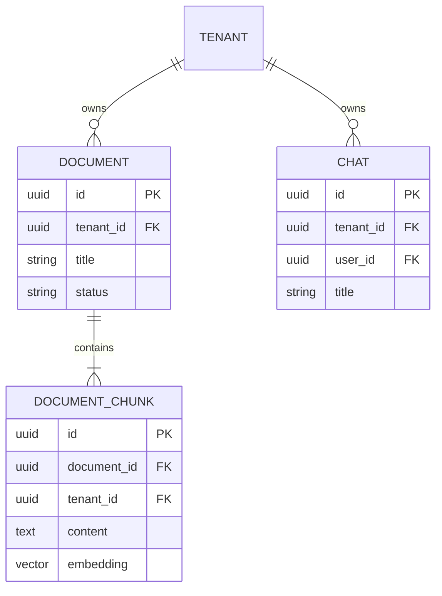

# Data Delta: Multi-Tenant Schema Isolation

Este documento descreve as alterações físicas e conceituais no modelo de dados da plataforma **Alfabra Vector** para suportar isolamento lógico multi-tenant.

---

## 1. Alterações no Schema Relacional (PostgreSQL)

Para suportar o multi-tenancy, adicionamos a coluna `tenant_id` UUID às tabelas centrais do sistema, acompanhada de índices de performance e regras de Row-Level Security (RLS).



---

## 2. DDL das Mudanças (Flyway Migration Script)

O script de migração será gravado em `java-core/src/main/resources/db/migration/V6__add_multi_tenancy_rls.sql`.

```sql
-- 1. Adicionar colunas de tenant_id UUID nas tabelas principais
ALTER TABLE documents ADD COLUMN tenant_id UUID;
ALTER TABLE chats ADD COLUMN tenant_id UUID;
ALTER TABLE document_chunks ADD COLUMN tenant_id UUID;

-- 2. Backfill: Injetar um ID padrão temporário para dados antigos gerados na fase de MVP
UPDATE documents SET tenant_id = 'a0eebc99-9c0b-4ef8-bb6d-6bb9bd380a00' WHERE tenant_id IS NULL;
UPDATE chats SET tenant_id = 'a0eebc99-9c0b-4ef8-bb6d-6bb9bd380a00' WHERE tenant_id IS NULL;
UPDATE document_chunks SET tenant_id = 'a0eebc99-9c0b-4ef8-bb6d-6bb9bd380a00' WHERE tenant_id IS NULL;

-- 3. Aplicar restrição NOT NULL após o backfill
ALTER TABLE documents ALTER COLUMN tenant_id SET NOT NULL;
ALTER TABLE chats ALTER COLUMN tenant_id SET NOT NULL;
ALTER TABLE document_chunks ALTER COLUMN tenant_id SET NOT NULL;

-- 4. Criar índices para acelerar filtragens por tenant_id
CREATE INDEX idx_documents_tenant ON documents(tenant_id);
CREATE INDEX idx_chats_tenant ON chats(tenant_id);
CREATE INDEX idx_chunks_tenant ON document_chunks(tenant_id);

-- 5. Habilitar Row Level Security (RLS) nas tabelas vetoriais e de documentos
ALTER TABLE documents ENABLE ROW LEVEL SECURITY;
ALTER TABLE document_chunks ENABLE ROW LEVEL SECURITY;

-- 6. Definir Políticas de Segurança baseadas nas sessões de conexão do Spring Boot
CREATE POLICY tenant_documents_policy ON documents
    FOR ALL
    USING (tenant_id = NULLIF(current_setting('app.current_tenant_id', true), '')::uuid);

CREATE POLICY tenant_chunks_policy ON document_chunks
    FOR ALL
    USING (tenant_id = NULLIF(current_setting('app.current_tenant_id', true), '')::uuid);
```

---

## 3. Impacto nas Consultas Vetoriais (pgvector)

O índice HNSW existente na coluna `embedding` (para cálculo de distância de cosseno) continuará operacional. Ao executar uma busca semântica, o PostgreSQL combinará a filtragem de índice padrão do `tenant_id` com a busca HNSW no vetor, mantendo a performance mesmo com milhões de linhas distribuídas em múltiplos tenants.
