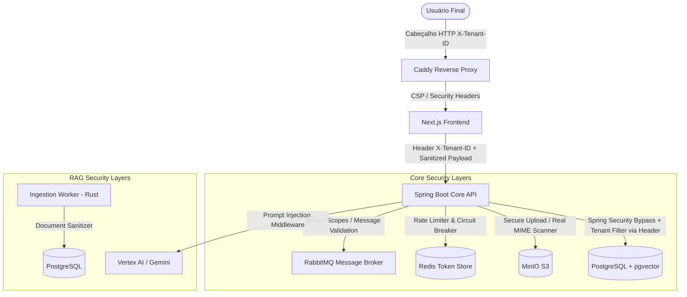

# Security Hardening & Defense in Depth Architecture (Com Autenticação Postergada)

Este documento descreve a arquitetura de segurança, especificações técnicas, fluxos de validação e códigos de referência para a estratégia de **Defense in Depth** na plataforma **Alfabra Vector**.

> [!IMPORTANT]
> Conforme decisão do usuário, **toda a camada de autenticação real (JWT, Session Hijacking, Refresh Token Rotation) está postergada** para uma fase futura de desenvolvimento. Para fins de testes rápidos e isolamento de multi-tenancy atual, a API Central aceitará a identificação do Tenant diretamente pelo header HTTP **`X-Tenant-ID`**.

---

## 1. Arquitetura de Segurança Recomendada (Desenvolvimento)

A arquitetura de segurança durante a fase de desenvolvimento foca no isolamento e na sanitização dos dados, omitindo barreiras de autenticação criptográfica:



---

## 2. Mudanças Necessárias por Serviço

### 2.1. Next.js Frontend
- **Isolamento de Tenant:** Injetar o header customizado `X-Tenant-ID` nas chamadas REST realizadas para o backend central. O ID do tenant pode ser mantido em estado local da aplicação ou contexto React.
- **XSS & CSP:** Integrar `DOMPurify` para sanitizar renderizações dinâmicas de Markdown/HTML vindas do RAG. Configurar cabeçalhos CSP rígidos no `next.config.js`.

### 2.2. Spring Boot Core API
- **Validação de Inquilino (Bypass de JWT):** Middleware/Interceptors que interceptam todas as requisições HTTP REST, extraem o `tenant_id` diretamente do header HTTP **`X-Tenant-ID`** e injetam na thread atual (`ThreadLocal`) para filtragem automatizada em consultas do JPA/Hibernate.
- **Upload Seguro:** Adicionar verificação de cabeçalhos mágicos (assinatura real de arquivo) usando bibliotecas como Apache Tika, rejeitando arquivos maliciosos ou disfarçados de PDF/DOCX.
- **Detector de Prompt Injection:** Interceptador para rotas de chat que analisam o prompt concatenado com padrões de injeção conhecidos e calculam score de risco.
- **Rate Limit & Circuit Breakers:** Integrar Bucket4j com Redis para rate-limit por IP/Tenant/Usuário. Integrar Resilience4j para circuit breaker nas chamadas externas do Vertex AI.

### 2.3. Rust Services (Ingestion, RAG, Embedding)
- **Sanitização de Documentos:** Ingestão de documentos deve filtrar caracteres de controle e delimitar rigidamente trechos em tags de markup (ex: `<context>...</context>`).
- **Isolamento de Queries Vetoriais:** O RAG Worker deve ler o escopo do tenant nas mensagens do RabbitMQ (passados via metadados extraídos do header original) e injetar a cláusula `WHERE tenant_id = ?` nas consultas vetoriais no PostgreSQL.

### 2.4. Python Services (CrewAI)
- **Isolamento e Restrição de Agents:** Configurar uma camada restritiva para o CrewAI, impondo limite de tempo (`timeout`), limite de chamadas a ferramentas de IA e allowlist de ferramentas permitidas.

---

## 3. Exemplos de Código

### 3.1. Extrator do Tenant via Header HTTP (Spring Boot)

```java
package com.company.core.infrastructure.security;

import org.springframework.stereotype.Component;
import org.springframework.web.servlet.HandlerInterceptor;
import jakarta.servlet.http.HttpServletRequest;
import jakarta.servlet.http.HttpServletResponse;
import java.util.UUID;

@Component
public class TenantInterceptor implements HandlerInterceptor {

    private static final ThreadLocal<UUID> currentTenant = new ThreadLocal<>();

    @Override
    public boolean preHandle(HttpServletRequest request, HttpServletResponse response, Object handler) throws Exception {
        String tenantHeader = request.getHeader("X-Tenant-ID");
        if (tenantHeader == null || tenantHeader.trim().isEmpty()) {
            response.setStatus(HttpServletResponse.SC_BAD_REQUEST);
            response.setContentType("application/json");
            response.getWriter().write("{\"error\": \"Header X-Tenant-ID is required for development multi-tenancy testing\"}");
            return false;
        }

        try {
            currentTenant.set(UUID.fromString(tenantHeader));
        } catch (IllegalArgumentException e) {
            response.setStatus(HttpServletResponse.SC_BAD_REQUEST);
            response.setContentType("application/json");
            response.getWriter().write("{\"error\": \"Invalid X-Tenant-ID UUID format\"}");
            return false;
        }

        return true;
    }

    @Override
    public void afterCompletion(HttpServletRequest request, HttpServletResponse response, Object handler, Exception ex) {
        currentTenant.remove();
    }

    public static UUID getCurrentTenantId() {
        return currentTenant.get();
    }
}
```

### 3.2. Isolamento de Inquilino pgvector (PostgreSQL Schema & Query)

```sql
-- Garante que cada tabela possua tenant_id
ALTER TABLE documents ADD COLUMN tenant_id UUID NOT NULL;
ALTER TABLE document_chunks ADD COLUMN tenant_id UUID NOT NULL;

-- Habilita Row Level Security (RLS) no PostgreSQL
ALTER TABLE document_chunks ENABLE ROW LEVEL SECURITY;

-- Cria política que limita acesso baseado no tenant configurado na sessão
CREATE POLICY tenant_isolation_policy ON document_chunks
    FOR ALL
    USING (tenant_id = NULLIF(current_setting('app.current_tenant_id', true), '')::uuid);
```

Execução no Repository JPA Java:
```java
@Query(value = "SELECT c.*, 1 - (c.embedding <=> :vector) as similarity " +
               "FROM document_chunks c " +
               "WHERE c.tenant_id = :tenantId " +
               "ORDER BY c.embedding <=> :vector LIMIT :limit", nativeQuery = true)
List<DocumentChunk> searchSimilarVectors(@Param("vector") float[] vector, @Param("tenantId") UUID tenantId, @Param("limit") int limit);
```

### 3.3. Configuração de CSP e DOMPurify (Next.js)

```typescript
// next.config.js
const securityHeaders = [
  {
    key: 'Content-Security-Policy',
    value: "default-src 'self'; script-src 'self' 'unsafe-eval'; style-src 'self' 'unsafe-inline'; img-src 'self' data:; connect-src 'self' https://api.vertexai.google.com;"
  },
  {
    key: 'X-Content-Type-Options',
    value: 'nosniff'
  },
  {
    key: 'Referrer-Policy',
    value: 'strict-origin-when-cross-origin'
  }
];

module.exports = {
  async headers() {
    return [
      {
        source: '/(.*)',
        headers: securityHeaders,
      },
    ];
  },
};
```

Renderização de Markdown sanitizado com DOMPurify no React:
```typescript
import DOMPurify from 'dompurify';
import ReactMarkdown from 'react-markdown';

interface ChatBubbleProps {
  rawContent: string;
}

export function ChatBubble({ rawContent }: ChatBubbleProps) {
  const sanitizedContent = DOMPurify.sanitize(rawContent);
  return (
    <div className="prose dark:prose-invert">
      <ReactMarkdown>{sanitizedContent}</ReactMarkdown>
    </div>
  );
}
```

### 3.4. Upload Seguro com Validação Magic Bytes (Java)

```java
import org.apache.tika.Tika;
import org.springframework.web.multipart.MultipartFile;
import java.io.IOException;
import java.util.List;

public class FileUploadValidator {
    private static final Tika TIKA = new Tika();
    private static final List<String> ALLOWED_MIME_TYPES = List.of(
        "application/pdf",
        "application/vnd.openxmlformats-officedocument.wordprocessingml.document", // DOCX
        "text/plain",
        "text/csv"
    );

    public static boolean isValidFile(MultipartFile file) {
        try {
            // Detecta o MIME Type real através do fluxo de bytes (assinatura mágica)
            String detectedType = TIKA.detect(file.getInputStream());
            return ALLOWED_MIME_TYPES.contains(detectedType);
        } catch (IOException e) {
            return false;
        }
    }
}
```

---

## 4. Checklist de Implementação e Auditoria (Adaptado)

### 4.1. Checklist de Implementação (Passo a Passo)
- [ ] Criar migração Flyway adicionando `tenant_id` em todas as tabelas e habilitar RLS.
- [ ] Configurar o `TenantInterceptor` para ler o header `X-Tenant-ID` e salvar na thread local.
- [ ] Implementar o `PromptInjectionInterceptor` no pacote de segurança da API.
- [ ] Adicionar dependência `org.apache.tika` no `build.gradle.kts` e criar o validador de upload.
- [ ] Adicionar limites de ferramentas, profundidade de chamadas e timeout no CrewAI Worker.
- [ ] Adicionar `DOMPurify` no Next.js para todos os outputs do bot do chat.
- [ ] Configurar o frontend Next.js para enviar o header `X-Tenant-ID` em todas as chamadas.

### 4.2. Checklist de Auditoria (Verificação Pré-Release)
- [ ] Validar que chamadas sem o header `X-Tenant-ID` retornam HTTP 400 Bad Request.
- [ ] Validar se uploads de arquivos renomeados (ex: `script.sh` mudado para `documento.pdf`) são rejeitados pelo servidor.
- [ ] Testar se payloads contendo comandos e injeções conhecidas no chat geram score de risco adequado e são devidamente barrados.

---

## 5. Priorização de Ações por Criticidade

| Nível de Criticidade | Ação de Segurança | Impacto se não implementado |
|----------------------|-------------------|-----------------------------|
| **CRÍTICO** | Isolamento Multi-Tenant no Banco de Dados (RLS + Filtro via Header) | **Alto Risco:** Um inquilino acessa e lê trechos de documentos confidenciais de outro inquilino via busca vetorial. |
| **CRÍTICO** | Validação Magic Bytes de Documentos no Upload | **Alto Risco:** Ingestão de scripts maliciosos ou shell reversa via formulários de upload público/privado. |
| **ALTO** | Middleware de Detecção de Prompt Injection | **Risco de Segurança de IA:** Usuários quebrando regras do assistente, expondo instruções do sistema e vazando metadados. |
| **ALTO** | Rate Limiters & Timeouts de Workflows de IA | **Ataques de Negação de Serviço (DoS):** Consumo abusivo de tokens e custos exorbitantes na API do Vertex AI. |
| **MÉDIO** | DOMPurify e CSP no Next.js Frontend | **Cross-Site Scripting (XSS):** Execução de scripts nocivos no navegador por meio de injeção em documentos indexados no RAG. |
| **BAIXO** | Allowlist de Ferramentas no CrewAI Worker | **Problema Operacional:** Agentes autônomos executando ferramentas não planejadas, gerando loopings e custos desnecessários. |
| **POSTERGADO** | Autenticação JWT e Rotação de Tokens | Requisito movido ao Backlog de Segurança a pedido do usuário. |
