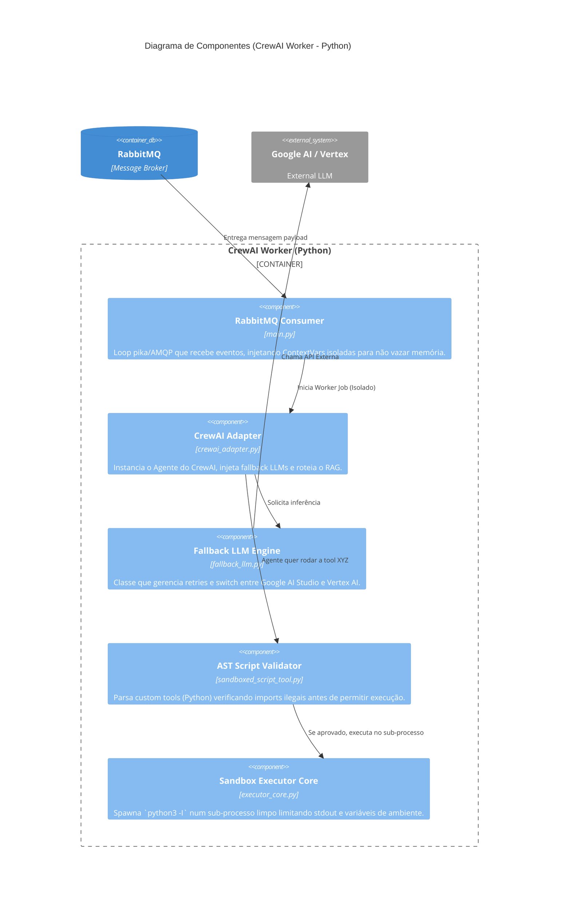

# Diagrama C4 Nível 3 - Componentes (Python Crew Worker)

```mermaid
C4Component
    title Diagrama de Componentes (CrewAI Worker - Python)

    Container_Boundary(python_worker, "CrewAI Worker (Python)") {
        Component(rmq_consumer, "RabbitMQ Consumer", "main.py", "Loop pika/AMQP que recebe eventos, injetando ContextVars isoladas para não vazar memória.")
        Component(crew_adapter, "CrewAI Adapter", "crewai_adapter.py", "Instancia o Agente do CrewAI, injeta fallback LLMs e roteia o RAG.")
        Component(llm_fallback, "Fallback LLM Engine", "fallback_llm.py", "Classe que gerencia retries e switch entre Google AI Studio e Vertex AI.")
        Component(ast_validator, "AST Script Validator", "sandboxed_script_tool.py", "Parsa custom tools (Python) verificando imports ilegais antes de permitir execução.")
        Component(sandbox_executor, "Sandbox Executor Core", "executor_core.py", "Spawna `python3 -I` num sub-processo limpo limitando stdout e variáveis de ambiente.")
    }

    ContainerDb(rabbitmq, "RabbitMQ", "Message Broker")
    System_Ext(llm, "Google AI / Vertex", "External LLM")

    Rel(rabbitmq, rmq_consumer, "Entrega mensagem payload")
    Rel(rmq_consumer, crew_adapter, "Inicia Worker Job (Isolado)")
    Rel(crew_adapter, llm_fallback, "Solicita inferência")
    Rel(llm_fallback, llm, "Chama API Externa")
    
    Rel(crew_adapter, ast_validator, "Agente quer rodar a tool XYZ")
    Rel(ast_validator, sandbox_executor, "Se aprovado, executa no sub-processo")
```
