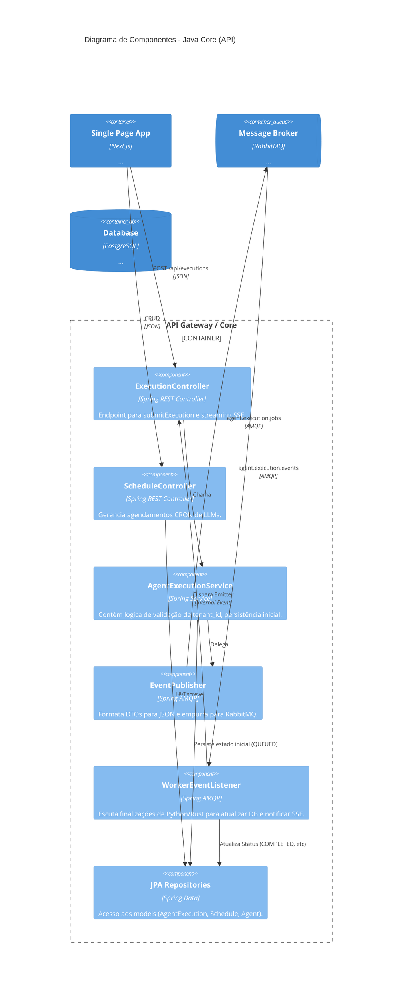

# C4 Model - Nível 3 (Componentes do Container API Gateway / Core)

```mermaid
C4Component
    title Diagrama de Componentes - Java Core (API)

    Container(spa, "Single Page App", "Next.js", "...")
    ContainerQueue(mq, "Message Broker", "RabbitMQ", "...")
    ContainerDb(db, "Database", "PostgreSQL", "...")

    Container_Boundary(api, "API Gateway / Core") {
        Component(exec_ctrl, "ExecutionController", "Spring REST Controller", "Endpoint para submitExecution e streaming SSE.")
        Component(schedule_ctrl, "ScheduleController", "Spring REST Controller", "Gerencia agendamentos CRON de LLMs.")
        Component(agent_exec_service, "AgentExecutionService", "Spring Service", "Contém lógica de validação de tenant_id, persistência inicial.")
        Component(amqp_publisher, "EventPublisher", "Spring AMQP", "Formata DTOs para JSON e empurra para RabbitMQ.")
        Component(amqp_listener, "WorkerEventListener", "Spring AMQP", "Escuta finalizações de Python/Rust para atualizar DB e notificar SSE.")
        Component(jpa, "JPA Repositories", "Spring Data", "Acesso aos models (AgentExecution, Schedule, Agent).")
    }

    Rel(spa, exec_ctrl, "POST /api/executions", "JSON")
    Rel(spa, schedule_ctrl, "CRUD", "JSON")
    
    Rel(exec_ctrl, agent_exec_service, "Chama")
    Rel(schedule_ctrl, jpa, "Lê/Escreve")
    
    Rel(agent_exec_service, jpa, "Persiste estado inicial (QUEUED)")
    Rel(agent_exec_service, amqp_publisher, "Delega")
    
    Rel(amqp_publisher, mq, "agent.execution.jobs", "AMQP")
    Rel(mq, amqp_listener, "agent.execution.events", "AMQP")
    
    Rel(amqp_listener, jpa, "Atualiza Status (COMPLETED, etc)")
    Rel(amqp_listener, exec_ctrl, "Dispara Emitter", "Internal Event")
```
