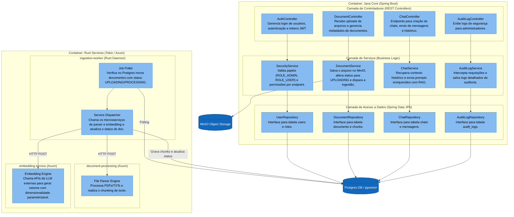

# Diagrama C4 — Componentes (Nível 3)

Este diagrama detalha a estrutura interna dos dois principais containers do sistema: **Java Core API** e o pipeline de **Rust Services**.

---

## 1. Componentes Internos da Java Core API

* **Controladores (Controllers):** Recebem requisições HTTP do Frontend. O `AuthController` intercepta logins; o `DocumentController` cuida dos uploads; o `ChatController` fornece respostas aos usuários; e o `AuditLogController` expõe dados ao administrador.
* **Serviços (Services):** Camada onde residem as regras de domínio. O `SecurityService` aplica o RBAC. O `DocumentService` inicia a escrita do arquivo bruto no MinIO e do metadado no Postgres. O `ChatService` orquestra a composição do prompt com o contexto recuperado por RAG. O `AuditLogService` é chamado por AOP (Aspect-Oriented Programming) ou filtros para auditar requisições críticas de forma automática.
* **Repositórios (Repositories):** Mapeamento relacional de tabelas de banco de dados via Spring Data JPA para realizar operações de CRUD no PostgreSQL.

---

## 2. Componentes Internos dos Rust Services

* **Job Poller (ingestion-worker):** Um daemon assíncrono Tokio que monitora continuamente no Postgres os documentos que necessitam de processamento.
* **Service Dispatcher (ingestion-worker):** Coordena o pipeline enviando o arquivo temporário para o `document-processing`, recuperando os trechos, enviando ao `embedding-service` para calcular os vetores e inserindo em lote (`batch insert`) os chunks na tabela `document_chunks`.
* **File Parser Engine (document-processing):** Lê os bytes do documento e extrai o texto plano, dividindo-o em trechos lógicos (chunks).
* **Embedding Engine (embedding-service):** Comunica-se com provedores externos via REST para retornar os arrays de floats da dimensão configurada.
