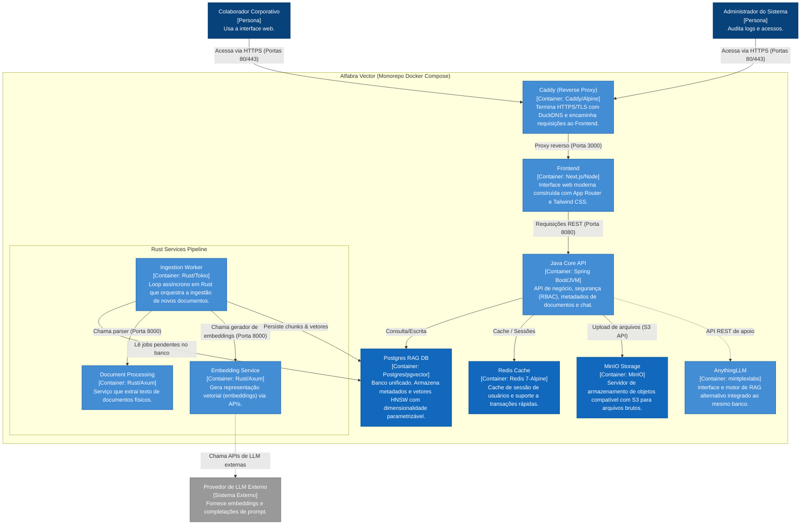

# Diagrama C4 — Containers (Nível 2)

Este diagrama detalha os containers executados no ecossistema da **Alfabra Vector**, as tecnologias utilizadas, suas responsabilidades e a comunicação de rede entre eles.

---

## 1. Descrição dos Containers e Tecnologias

1. **Caddy Proxy:** Único container com portas expostas (`80:80` e `443:443`). Garante TLS automático por DNS Challenge com DuckDNS.
2. **Next.js Frontend:** UI SPA/SSR executando na porta 3000 interna. Comunica-se com o Spring Boot para operações autenticadas.
3. **Java Core (Spring Boot):** Gerencia lógica complexa de negócios, regras de auditoria e RBAC na porta 8080.
4. **Redis:** Usado como repositório de cache e armazenamento temporário para otimização de performance das sessões.
5. **MinIO:** Armazena os arquivos físicos originais (PDFs, TXTs) antes de serem divididos em trechos.
6. **Postgres (`pgvector`):** Persistência principal contendo a tabela de usuários, chats, auditoria e a tabela `document_chunks` com um índice HNSW.
7. **AnythingLLM:** Container alternativo integrado ao Postgres para visualização ou pipelines alternativos de RAG.
8. **Rust Ingestion Pipeline:**
   - **Ingestion Worker:** Loop assíncrono que detecta quando um novo documento muda para `UPLOADING` ou `PROCESSING` e orquestra as tarefas.
   - **Document Processing:** API HTTP interna (Axum, porta 8000) que faz a leitura física do arquivo e divide o texto em parágrafos/blocos.
   - **Embedding Service:** API HTTP interna (Axum, porta 8000) que faz chamadas externas para geração de vetores com dimensionalidade parametrizável de acordo com o modelo configurado.
