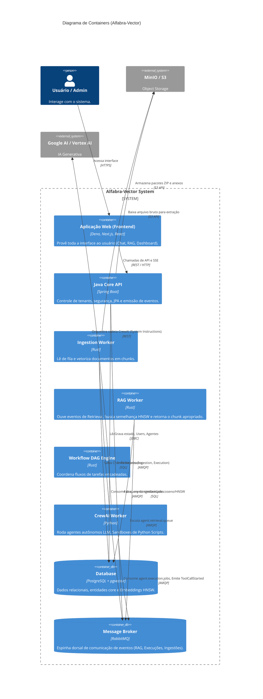

# Diagrama C4 Nível 2 - Containers

```mermaid
C4Container
    title Diagrama de Containers (Alfabra-Vector)

    Person(usuario, "Usuário / Admin", "Interage com o sistema.")

    System_Boundary(alfabra, "Alfabra-Vector System") {
        Container(spa, "Aplicação Web (Frontend)", "Deno, Next.js, React", "Provê toda a interface ao usuário (Chat, RAG, Dashboard).")
        Container(api_gateway, "Java Core API", "Spring Boot", "Controle de tenants, segurança, JPA e emissão de eventos.")
        Container(rust_ingestion, "Ingestion Worker", "Rust", "Lê de fila e vetoriza documentos em chunks.")
        Container(rust_rag, "RAG Worker", "Rust", "Ouve eventos de Retrieval, busca semelhança HNSW e retorna o chunk apropriado.")
        Container(rust_workflow, "Workflow DAG Engine", "Rust", "Coordena fluxos de tarefas encadeadas.")
        Container(python_crew, "CrewAI Worker", "Python", "Roda agentes autônomos LLM, Sandboxes de Python Scripts.")
        
        ContainerDb(postgres, "Database", "PostgreSQL + pgvector", "Dados relacionais, entidades core e Embeddings HNSW.")
        ContainerDb(rabbitmq, "Message Broker", "RabbitMQ", "Espinha dorsal de comunicação de eventos (RAG, Execuções, Ingestões).")
    }

    System_Ext(minio, "MinIO / S3", "Object Storage")
    System_Ext(llm, "Google AI / Vertex AI", "IA Generativa")

    Rel(usuario, spa, "Acessa interface", "HTTPS")
    Rel(spa, api_gateway, "Chamadas de API e SSE", "REST / HTTP")
    
    Rel(api_gateway, postgres, "Lê/Grava estado, Users, Agentes", "JDBC")
    Rel(api_gateway, rabbitmq, "Enfileira Jobs (Ingestion, Execution)", "AMQP")
    Rel(api_gateway, minio, "Armazena pacotes ZIP e anexos", "S3 API")

    Rel(rust_ingestion, rabbitmq, "Consome document.ingestion.jobs", "AMQP")
    Rel(rust_ingestion, postgres, "Salva Chunks Vetorizados", "SQL")
    Rel(rust_ingestion, minio, "Baixa arquivo bruto para extração", "S3 API")

    Rel(python_crew, rabbitmq, "Consome agent.execution.jobs, Emite ToolCallStarted", "AMQP")
    Rel(python_crew, llm, "Orquestra cadeia CrewAI (System Instructions)", "REST")

    Rel(rust_rag, rabbitmq, "Escuta agent.retrieval.queue", "AMQP")
    Rel(rust_rag, postgres, "Faz query de similaridade coseno/HNSW", "SQL")
```
