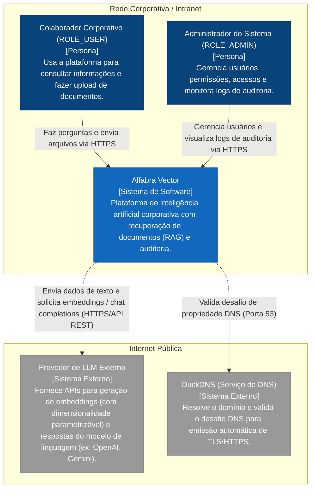

# Diagrama C4 — Contexto (Nível 1)

Este diagrama apresenta o escopo da plataforma **Alfabra Vector** no nível de contexto do usuário, definindo seus limites corporativos, as personas envolvidas e os sistemas externos integrados.

---

## 1. Personas e Atores

1. **Colaborador Corporativo (`ROLE_USER`):** Usuários do ecossistema corporativo autorizados a fazer upload de arquivos e interagir com o agente RAG no chat para responder dúvidas de domínio.
2. **Administrador (`ROLE_ADMIN`):** Usuários internos de TI ou segurança que necessitam auditar operações por questões de conformidade (via painel de logs de auditoria) e gerenciar perfis de acesso dos usuários.

---

## 2. Sistemas Externos e Integrações

1. **Provedor de LLM/Embeddings:** Responsável por calcular vetores de dimensionalidade parametrizável baseados nos trechos dos documentos e completar prompts de conversa gerando respostas coerentes.
2. **DuckDNS:** Utilizado no processo de setup do Caddy para provar propriedade de domínio sob a infraestrutura e obter certificados TLS da Let's Encrypt de forma automática.
