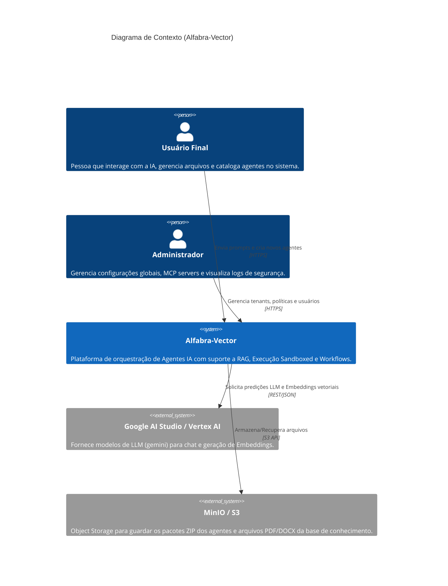

# Diagrama C4 Nível 1 - Contexto

```mermaid
C4Context
    title Diagrama de Contexto (Alfabra-Vector)

    Person(usuario, "Usuário Final", "Pessoa que interage com a IA, gerencia arquivos e cataloga agentes no sistema.")
    Person(admin, "Administrador", "Gerencia configurações globais, MCP servers e visualiza logs de segurança.")

    System(alfabra_vector, "Alfabra-Vector", "Plataforma de orquestração de Agentes IA com suporte a RAG, Execução Sandboxed e Workflows.")

    System_Ext(llm_provider, "Google AI Studio / Vertex AI", "Fornece modelos de LLM (gemini) para chat e geração de Embeddings.")
    System_Ext(minio, "MinIO / S3", "Object Storage para guardar os pacotes ZIP dos agentes e arquivos PDF/DOCX da base de conhecimento.")

    Rel(usuario, alfabra_vector, "Envia prompts e cria novos agentes", "HTTPS")
    Rel(admin, alfabra_vector, "Gerencia tenants, políticas e usuários", "HTTPS")
    
    Rel(alfabra_vector, llm_provider, "Solicita predições LLM e Embeddings vetoriais", "REST/JSON")
    Rel(alfabra_vector, minio, "Armazena/Recupera arquivos", "S3 API")
```
