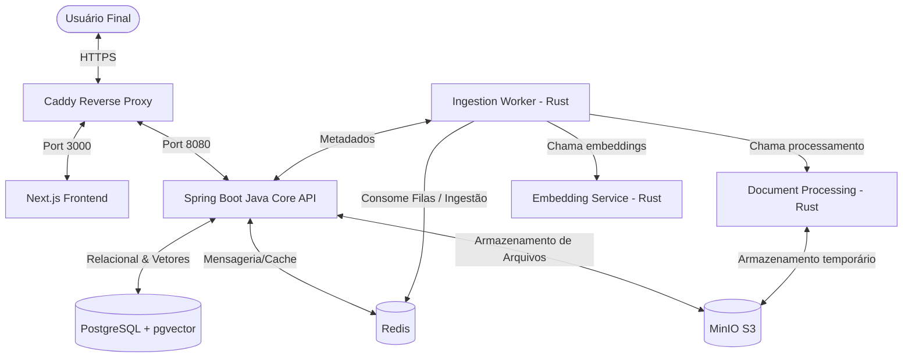

# Análise Técnica do Código Legado - alfabra_vector

Este documento apresenta a análise técnica detalhada do código fonte do projeto **alfabra_vector**, consolidada pelo **Arqueólogo** do framework Reversa.

---

## 🏛️ Visão de Arquitetura de Software

A plataforma é estruturada como um **Monorepo** contendo quatro módulos fundamentais que interagem para formar a plataforma corporativa de RAG (Retrieval-Augmented Generation):

---

## 💻 1. Módulo: `frontend` (Next.js & TypeScript) 🟢 **CONFIRMADO**

### 📋 Visão Geral
* **Caminho no Repositório:** `frontend`
* **Propósito:** Interface web corporativa do usuário. Atualmente, possui uma estrutura arquitetural de diretórios pré-configurada e layouts base.
* **Complexidade:** Baixa (Esqueleto inicial).

### 🔍 Principais Arquivos Analisados
1. [frontend/src/app/layout.tsx](file:///Users/vitortavares/Desktop/Alfabra%20Vector/frontend/src/app/layout.tsx): Ponto de entrada do Layout principal da aplicação. Controla tags HTML globais e tema padrão.
2. [frontend/src/app/auth/layout.tsx](file:///Users/vitortavares/Desktop/Alfabra%20Vector/frontend/src/app/auth/layout.tsx): Layout especializado para fluxos de autenticação, oferecendo containers centralizados na tela.
3. [frontend/package.json](file:///Users/vitortavares/Desktop/Alfabra%20Vector/frontend/package.json): Especificação de dependências e scripts de automação.

### 🔄 Fluxos de Controle e Lógica
* **Estrutura de Rotas:** Utiliza o Next.js App Router. A pasta `src/app/` define as rotas. Atualmente, apenas o subdiretório `auth` possui um layout estruturado.
* **Tematização:** O corpo da página principal está estilizado com classes Tailwind CSS que suportam modos claro e escuro (`bg-white dark:bg-gray-950`).

### 🛠️ Tecnologias e Dependências Principais
* **Framework:** Next.js `14.2.3` / React `^18`.
* **Estilização:** Tailwind CSS `^3.4.1`, `clsx`, `tailwind-merge`.
* **Animações:** Framer Motion `^11.1.7` para micro-interações.

---

## ☕ 2. Módulo: `java-core` (Spring Boot API) 🟢 **CONFIRMADO**

### 📋 Visão Geral
* **Caminho no Repositório:** `java-core`
* **Propósito:** API backend monolítica central. Gerencia as regras de negócio de alto nível, autenticação, controle de permissões (RBAC), metadados de documentos persistidos e sessões de chat.
* **Complexidade:** Média (Contém a definição completa do banco de dados e controle de acesso).

### 🔍 Principais Arquivos Analisados
1. [java-core/src/main/java/com/company/core/Application.java](file:///Users/vitortavares/Desktop/Alfabra%20Vector/java-core/src/main/java/com/company/core/Application.java): Classe de inicialização principal `@SpringBootApplication`.
2. [java-core/src/main/resources/application.yml](file:///Users/vitortavares/Desktop/Alfabra%20Vector/java-core/src/main/resources/application.yml): Configurações de conexão do Spring (DataSource, Hibernate JPA, Flyway, Redis, Actuator).
3. [java-core/src/main/resources/db/migration/V1__init_schema.sql](file:///Users/vitortavares/Desktop/Alfabra%20Vector/java-core/src/main/resources/db/migration/V1__init_schema.sql): Migração Flyway inicial que modela fisicamente o banco de dados.

### 🔄 Fluxos de Controle e Lógica
* **Inicialização:** A classe `Application.java` delega a execução ao `SpringApplication.run`.
* **Inicialização de Banco (Flyway):** O ciclo de vida do banco é orquestrado via Flyway migrations (`spring.flyway.enabled: true`), executando arquivos a partir de `db/migration/`. A validação do DDL pelo JPA/Hibernate impede alterações ad-hoc (`ddl-auto: validate`).

### 📦 Regras de Negócio e Segurança (RBAC)
* **Usuários:** Possuem status padronizado (`ACTIVE`, `INACTIVE`, etc.) e identificador único UUID auto-gerado.
* **Modelagem de Segurança (RBAC):**
  * Tabela de `roles` e `permissions` com relacionamento muitos-para-muitos via `role_permissions` e `user_roles`.
  * Regras pré-semeadas (Seeds):
    * `ROLE_ADMIN` (a0eebc99-9c0b-4ef8-bb6d-6bb9bd380a11): Possui todas as permissões (`READ_DOCUMENTS`, `WRITE_DOCUMENTS`, `DELETE_DOCUMENTS`, `VIEW_AUDIT_LOGS`, `MANAGE_USERS`).
    * `ROLE_USER` (a0eebc99-9c0b-4ef8-bb6d-6bb9bd380a12): Possui permissão restrita para leitura (`READ_DOCUMENTS`) e escrita (`WRITE_DOCUMENTS`) de documentos.
* **Status dos Documentos:** Controlado por máquina de estado simples na coluna `status` da tabela `documents` (`UPLOADING`, `PROCESSING`, `INDEXED`, `FAILED`).

---

## ⚙️ 3. Módulo: `rust-services` (Microsserviços de IA) 🟢 **CONFIRMADO**

### 📋 Visão Geral
* **Caminho no Repositório:** `rust-services`
* **Propósito:** Processamento de carga de trabalho assíncrona pesada (extração de documentos, cálculo de embeddings vetoriais com suporte a pgvector e ingestão contínua em segundo plano).
* **Complexidade:** Baixa (Esqueleto funcional robusto).

### 🔍 Principais Arquivos Analisados
1. [rust-services/document-processing/src/main.rs](file:///Users/vitortavares/Desktop/Alfabra%20Vector/rust-services/document-processing/src/main.rs): Servidor HTTP assíncrono Axum rodando na porta `8000`.
2. [rust-services/embedding-service/src/main.rs](file:///Users/vitortavares/Desktop/Alfabra%20Vector/rust-services/embedding-service/src/main.rs): Servidor HTTP assíncrono Axum rodando na porta `8000`.
3. [rust-services/ingestion-worker/src/main.rs](file:///Users/vitortavares/Desktop/Alfabra%20Vector/rust-services/ingestion-worker/src/main.rs): Daemon Worker com loop de execução assíncrono infinito (Tokio runtime).
4. [rust-services/shared/src/lib.rs](file:///Users/vitortavares/Desktop/Alfabra%20Vector/rust-services/shared/src/lib.rs): Biblioteca local contendo estruturas e utilitários de dados compartilhados entre os microsserviços.

### 🔄 Fluxos de Controle e Lógica
* **Servidores HTTP (Axum):** Implementam handlers assíncronos baseados em `tokio::net::TcpListener` e gerenciam requests no threadpool assíncrono nativo do Rust. Ambos expõem um endpoint padrão `/healthz` respondendo "OK" para integridade e readiness probes.
* **Daemon de Ingestão (ingestion-worker):** Possui um loop infinito que simula heartbeats a cada 60 segundos com `tokio::time::sleep`.

---

## 🌐 4. Módulo: `infrastructure` (Provisionamento e Proxy) 🟢 **CONFIRMADO**

### 📋 Visão Geral
* **Caminho no Repositório:** `infrastructure`
* **Propósito:** Configurações de infraestrutura de rede, orquestração local, barreira de firewall do host e persistência inicial.
* **Complexidade:** Baixa.

### 🔍 Principais Arquivos Analisados
1. [infrastructure/caddy/Caddyfile](file:///Users/vitortavares/Desktop/Alfabra%20Vector/infrastructure/caddy/Caddyfile): Configuração do proxy reverso SSL Caddy.
2. [infrastructure/postgres/init.sql](file:///Users/vitortavares/Desktop/Alfabra%20Vector/infrastructure/postgres/init.sql): Script SQL executado na primeira inicialização do container PostgreSQL.
3. [infrastructure/setup_firewall.sh](file:///Users/vitortavares/Desktop/Alfabra%20Vector/infrastructure/setup_firewall.sh): Utilitário bash de segurança local.

### 🔄 Regras e Lógica de Rede
* **Caddy Routing:** O tráfego HTTPS direcionado ao domínio principal é interceptado pelo Caddy. O TLS é provido via DuckDNS API challenge (`tls { dns duckdns ... }`). O tráfego de saída do proxy é encaminhado via rede interna Docker para a porta 3000 do container `frontend` (`reverse_proxy frontend:3000`).
* **PostgreSQL Extensões:** Garante que o banco de dados RAG suporte busca vetorial ativando o plugin `vector` (pgvector) e o gerador de UUIDs `uuid-ossp`.

---

## 🎯 Escala de Confiança dos Módulos

A análise das especificações atinge o nível máximo de fidelidade ao código-fonte, uma vez que o repositório foi escavado por completo.

| Módulo | Escala de Confiança | Justificativa |
|---|---|---|
| `frontend` | 🟢 CONFIRMADO | Estrutura de pastas, layout geral e dependências validadas diretamente nos arquivos de projeto. |
| `java-core` | 🟢 CONFIRMADO | Estrutura Spring, arquivo de properties `.yml` e schema SQL mapeados diretamente. |
| `rust-services` | 🟢 CONFIRMADO | Arquivos `main.rs` e `Cargo.toml` de todos os sub-microsserviços lidos. |
| `infrastructure` | 🟢 CONFIRMADO | Caddyfile e scripts shell analisados em sua totalidade. |
