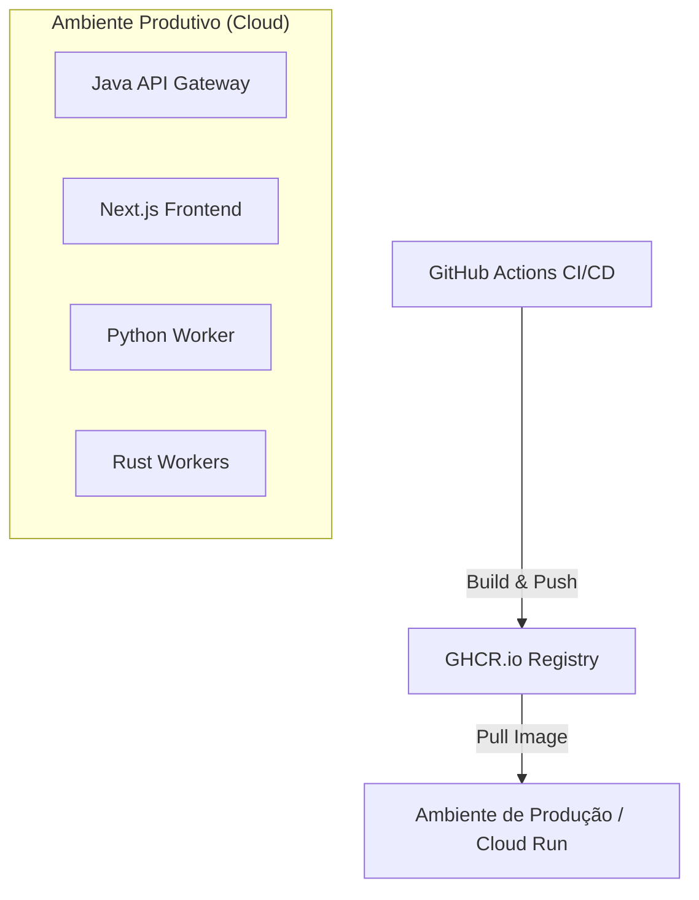

# Infraestrutura e Implantação (Deployment)

## Visão Geral de Deploy
Baseado no `docker-compose.yml` e scripts de CI detectados, o Alfabra-Vector utiliza conteinerização plena.

## Ambiente Local / Homologação (Docker Compose)
O projeto provê um orquestrador unificado via Compose subindo a seguinte pilha:
- `alfabra-frontend`: Imagem construída via Node/Deno na porta 3000.
- `alfabra-backend`: Imagem do Spring Boot na porta 8080.
- `postgres-db`: Container contendo PostgreSQL com a extensão gen-AI `pgvector` pré-instalada (porta 5432).
- `rabbitmq`: Fila local de eventos (porta 5672) e management (porta 15672).
- `minio`: Simulação do AWS S3 rodando local (porta 9000).
- `rust-ingestion-worker`, `rust-rag-worker`, `crew-python-worker`: Containers trabalhadores isolados conectando ao rabbitmq e ao postgres interno via alias de rede.

## Pipeline de CI/CD (GitHub Actions)
- **Builds GHCR:** O CI gera imagens OCI otimizadas (Docker) e as envia para o GitHub Container Registry (`ghcr.io/tavaressan/alfabra-vector-*`).
- **Runners Customizados:** Há uso de runners auto-hospedados (self-hosted) na AWS EC2 para compilar as imagens pesadas de Rust (evitando o gargalo de minutos grátis do GitHub Actions).
- **Google Cloud Run:** Identificou-se que o serviço Web (backend e frontend) e os workers são potencialmente passíveis de deploy no Google Cloud via CD.
- **Trivy / SAST:** Etapas rigorosas de scan de dependências evitam o deploy de imagens vulneráveis (Issue #425).

