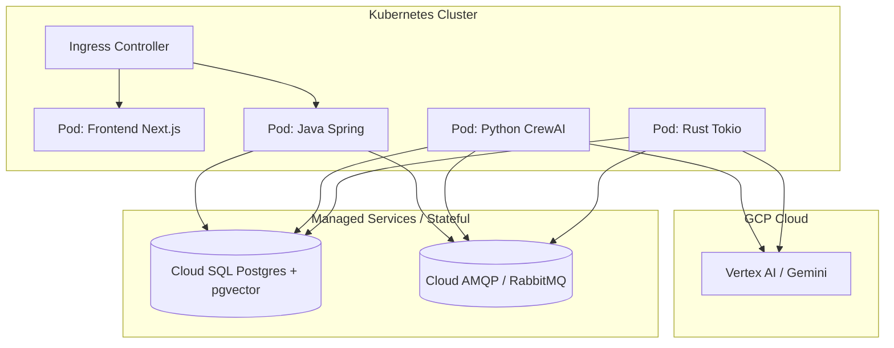

# Deployment e Topologia de Infraestrutura

> Gerado automaticamente pelo `reversa-architect`

## Ambiente de Desenvolvimento (Docker Compose)
Toda a pilha orquestrada via `docker-compose.yml` raiz.
* Monta os serviços `java-core`, `crew-worker`, `rag-worker` consumindo redes internas (`backend-tier`, `db-tier`).
* A porta 5432 exposta permite gestão direta do Postgres localmente.
* A porta 5672 exposta requer o `setup_firewall.sh` no Linux/Host para impedir acesso desautorizado.

## Ambiente de Produção (Kubernetes)
(Baseado na existência da pasta `infrastructure/kubernetes`)
* **Ingress**: Substitui o Caddy dev pelo NGINX Ingress Controller.
* **Secrets**: Chaves do GCP (`GOOGLE_APPLICATION_CREDENTIALS` ou `VERTEX_AI_API_KEY`) injetadas via K8s Secrets.
* **Scaling**: Workers Python e Rust (sendo sem estado após consumo Rabbit) escalam horizontalmente baseado no backlog da fila (KEDA).

## Diagrama Físico (Produção)

