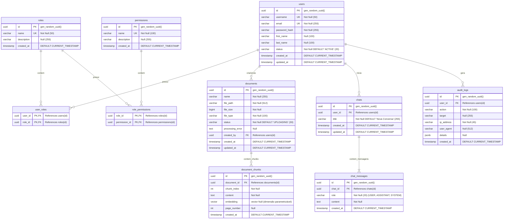

# Modelo Entidade-Relacionamento Completo (ERD)

Este documento apresenta o modelo lógico do banco de dados relacional e vetorial PostgreSQL, mapeado a partir dos scripts de migração do Flyway (`V1__init_schema.sql`).

---

## 1. Descrição Detalhada das Entidades

1. **`users` (Usuários):** Mapeia os usuários que acessam o sistema. A coluna `status` permite bloquear usuários (inativos/banidos).
2. **`roles` e `permissions` (Segurança RBAC):** Implementam a estrutura padrão de RBAC. A tabela associativa `role_permissions` une os papéis às permissões granulares, e `user_roles` une os usuários aos seus papéis correspondentes.
3. **`documents` (Metadados de Arquivos):** Mantém a referência do arquivo original (no MinIO/S3), informações de auditoria de upload (`created_by`), status atual do processamento vetorial (`status`) e logs de erro se aplicável.
4. **`document_chunks` (Repositório Vetorial):** A entidade central da busca semântica. O campo `embedding` é um tipo especial `vector` (com largura dimensional parametrizável de acordo com o modelo configurado) com índice HNSW para buscas de cosseno eficientes. Possui chave estrangeira para o documento pai.
5. **`chats` e `chat_messages` (Conversação):** Mantêm o histórico persistido das conversas. `chat_messages` armazena a conversa sequencial com as tags `role` (`USER` para o usuário, `ASSISTANT` para a resposta gerada por RAG, e `SYSTEM` para instruções/prompts base).
6. **`audit_logs` (Logs de Auditoria):** Registra eventos de segurança sensíveis. O campo `details` é um JSONB dinâmico que permite estender metadados das ações realizadas.
