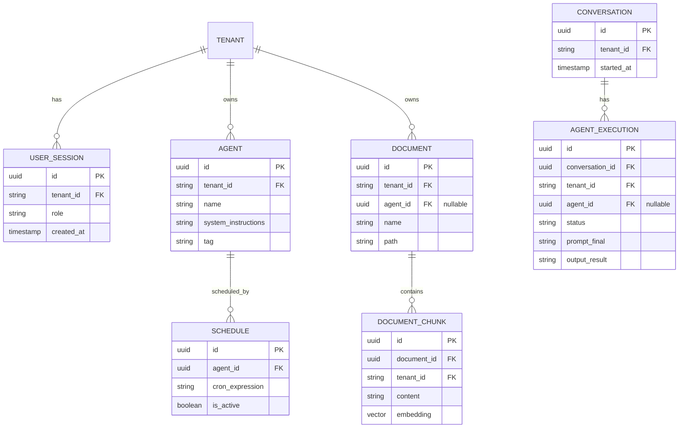

# ERD Completo (Entity-Relationship Diagram)

```mermaid
erDiagram
    TENANT ||--o{ USER_SESSION : has
    TENANT ||--o{ AGENT : owns
    TENANT ||--o{ DOCUMENT : owns
    
    USER_SESSION {
        uuid id PK
        string tenant_id FK
        string role
        timestamp created_at
    }

    AGENT {
        uuid id PK
        string tenant_id FK
        string name
        string system_instructions
        string tag
    }

    DOCUMENT {
        uuid id PK
        string tenant_id FK
        uuid agent_id FK "nullable"
        string name
        string path
    }

    DOCUMENT ||--o{ DOCUMENT_CHUNK : contains
    
    DOCUMENT_CHUNK {
        uuid id PK
        uuid document_id FK
        string tenant_id FK
        string content
        vector embedding
    }

    CONVERSATION {
        uuid id PK
        string tenant_id FK
        timestamp started_at
    }

    CONVERSATION ||--o{ AGENT_EXECUTION : has

    AGENT_EXECUTION {
        uuid id PK
        uuid conversation_id FK
        string tenant_id FK
        uuid agent_id FK "nullable"
        string status
        string prompt_final
        string output_result
    }

    AGENT ||--o{ SCHEDULE : scheduled_by
    
    SCHEDULE {
        uuid id PK
        uuid agent_id FK
        string cron_expression
        boolean is_active
    }
```
