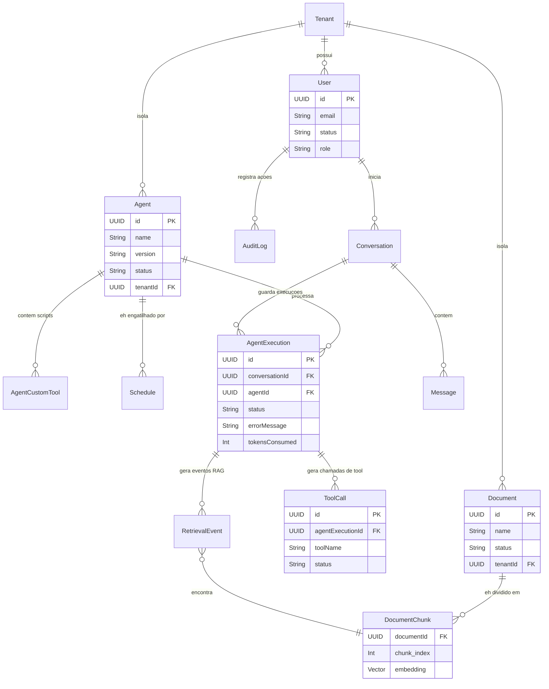

# Diagrama Entidade-Relacionamento Completo

```mermaid
erDiagram
    User ||--o{ Conversation : "inicia"
    User ||--o{ AuditLog : "registra acoes"
    
    Tenant ||--o{ User : "possui"
    Tenant ||--o{ Agent : "isola"
    Tenant ||--o{ Document : "isola"

    Agent ||--o{ AgentCustomTool : "contem scripts"
    Agent ||--o{ Schedule : "eh engatilhado por"
    Agent ||--o{ AgentExecution : "processa"
    
    Conversation ||--o{ Message : "contem"
    Conversation ||--o{ AgentExecution : "guarda execucoes"
    
    AgentExecution ||--o{ ToolCall : "gera chamadas de tool"
    AgentExecution ||--o{ RetrievalEvent : "gera eventos RAG"
    
    Document ||--o{ DocumentChunk : "eh dividido em"
    RetrievalEvent }o--|| DocumentChunk : "encontra"

    User {
        UUID id PK
        String email
        String status
        String role
    }

    Agent {
        UUID id PK
        String name
        String version
        String status
        UUID tenantId FK
    }

    AgentExecution {
        UUID id PK
        UUID conversationId FK
        UUID agentId FK
        String status
        String errorMessage
        Int tokensConsumed
    }

    ToolCall {
        UUID id PK
        UUID agentExecutionId FK
        String toolName
        String status
    }

    Document {
        UUID id PK
        String name
        String status
        UUID tenantId FK
    }

    DocumentChunk {
        UUID documentId FK
        Int chunk_index
        Vector embedding
    }
```
