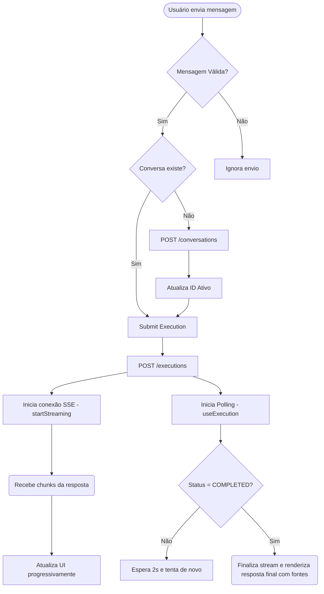

```mermaid
graph TD
    Start([Usuário envia mensagem]) --> Validate{Mensagem Válida?}
    Validate -- Sim --> CreateConv{Conversa existe?}
    Validate -- Não --> Ignore[Ignora envio]

    CreateConv -- Não --> CallAPI_CreateConv[POST /conversations]
    CallAPI_CreateConv --> UpdateConvState[Atualiza ID Ativo]
    CreateConv -- Sim --> SubmitPrompt[Submit Execution]
    
    UpdateConvState --> SubmitPrompt

    SubmitPrompt --> API_Exec[POST /executions]
    API_Exec --> StartSSE[Inicia conexão SSE - startStreaming]
    API_Exec --> StartPolling[Inicia Polling - useExecution]

    StartSSE --> StreamUpdate(Recebe chunks da resposta)
    StreamUpdate --> RenderBubble[Atualiza UI progressivamente]

    StartPolling --> CheckStatus{Status = COMPLETED?}
    CheckStatus -- Não --> PollingWait[Espera 2s e tenta de novo]
    CheckStatus -- Sim --> End(Finaliza stream e renderiza resposta final com fontes)
```
