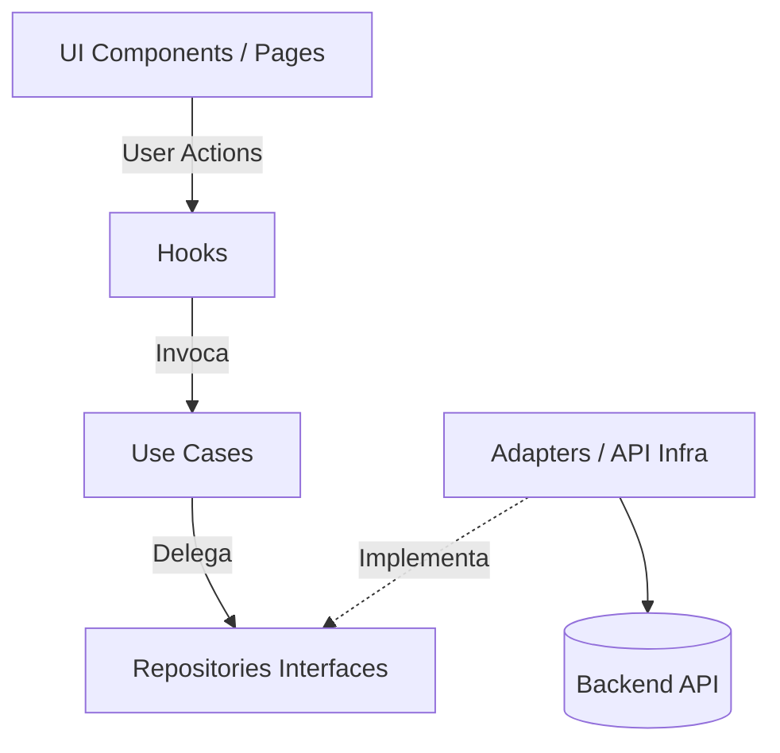
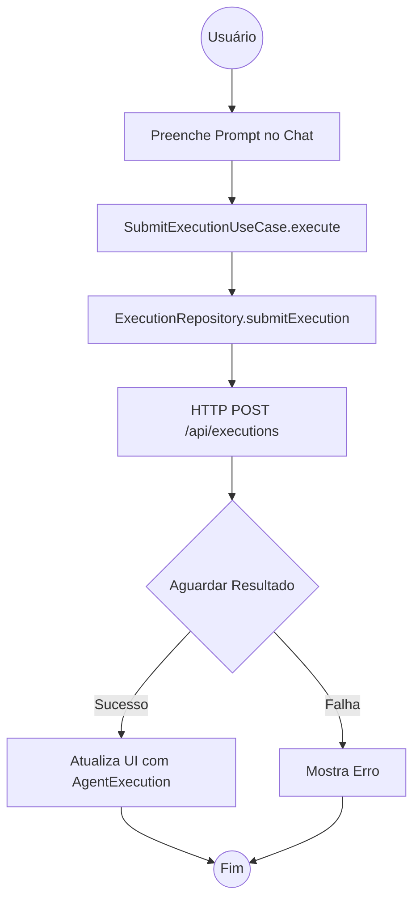

# Fluxogramas do Módulo: frontend

## Arquitetura de Componentes Front-End

```mermaid
graph TD
    A[UI Components / Pages] -->|User Actions| B[Hooks]
    B -->|Invoca| C[Use Cases]
    C -->|Delega| D[Repositories Interfaces]
    E[Adapters / API Infra] -.->|Implementa| D
    E --> F[(Backend API)]
```

## Fluxo de Submissão de Execução de Agente

```mermaid
flowchart TD
    Start((Usuário)) --> Submit[Preenche Prompt no Chat]
    Submit --> Usecase[SubmitExecutionUseCase.execute]
    Usecase --> Repo[ExecutionRepository.submitExecution]
    Repo --> API[HTTP POST /api/executions]
    API --> Wait{Aguardar Resultado}
    Wait -->|Sucesso| UpdateState[Atualiza UI com AgentExecution]
    Wait -->|Falha| ShowError[Mostra Erro]
    UpdateState --> End((Fim))
    ShowError --> End
```
