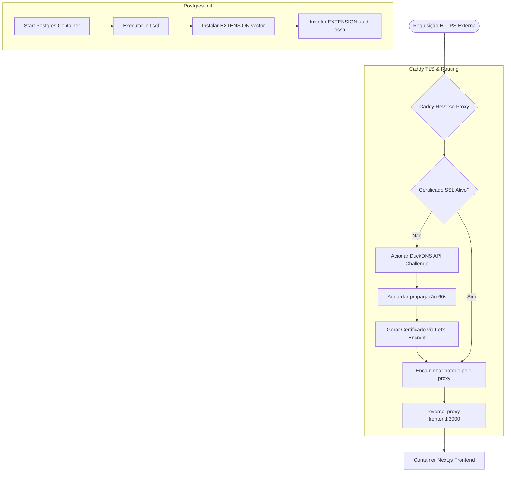

# Fluxograma de Controle: infrastructure 🟢 **CONFIRMADO**

Este fluxograma ilustra o fluxo de roteamento de rede externa e provisionamento de DNS e segurança orquestrado pelo proxy reverso Caddy e as configurações de host.

