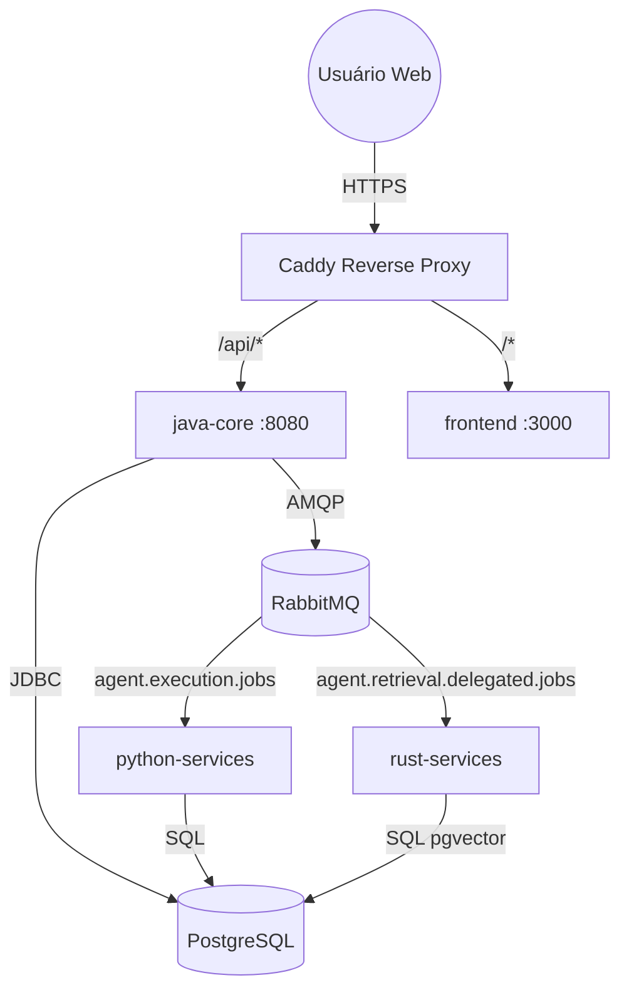

# Fluxogramas do Módulo: infrastructure

## Topologia de Rede e Roteamento (Caddy Proxy)

```mermaid
graph TD
    Client((Usuário Web)) --> |HTTPS| Caddy[Caddy Reverse Proxy]
    Caddy --> |/api/*| Java[java-core :8080]
    Caddy --> |/*| FE[frontend :3000]
    
    Java --> |AMQP| Rabbit[(RabbitMQ)]
    Java --> |JDBC| PG[(PostgreSQL)]
    
    Rabbit --> |agent.execution.jobs| Py[python-services]
    Rabbit --> |agent.retrieval.delegated.jobs| Rust[rust-services]
    
    Py --> |SQL| PG
    Rust --> |SQL pgvector| PG
```
