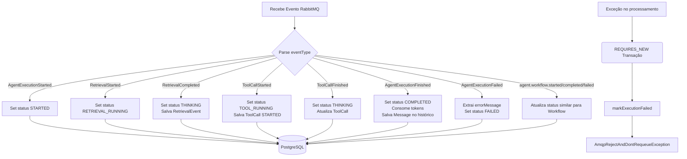

# Fluxograma: java-core - handleExecutionEvent

```mermaid
graph TD
    A[Recebe Evento RabbitMQ] --> B{Parse eventType}
    B -->|AgentExecutionStarted| C[Set status STARTED]
    B -->|RetrievalStarted| D[Set status RETRIEVAL_RUNNING]
    B -->|RetrievalCompleted| E[Set status THINKING <br> Salva RetrievalEvent]
    B -->|ToolCallStarted| F[Set status TOOL_RUNNING <br> Salva ToolCall STARTED]
    B -->|ToolCallFinished| G[Set status THINKING <br> Atualiza ToolCall]
    B -->|AgentExecutionFinished| H[Set status COMPLETED <br> Consome tokens <br> Salva Message no histórico]
    B -->|AgentExecutionFailed| I[Extrai errorMessage <br> Set status FAILED]
    B -->|agent.workflow.started/completed/failed| J[Atualiza status similar para Workflow]
    
    C --> K[(PostgreSQL)]
    D --> K
    E --> K
    F --> K
    G --> K
    H --> K
    I --> K
    J --> K
    
    L[Exceção no processamento] --> M(REQUIRES_NEW Transação)
    M --> N[markExecutionFailed]
    N --> O[AmqpRejectAndDontRequeueException]
```
