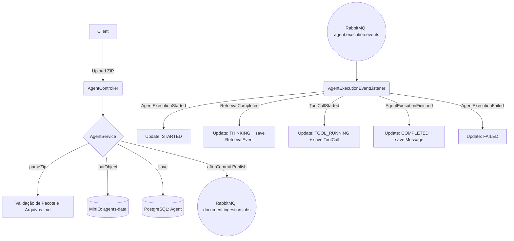

# Fluxograma: java-core

```mermaid
graph TD
    A[Client] -->|Upload ZIP| B(AgentController)
    B --> C{AgentService}
    C -->|parseZip| D[Validação de Pacote e Arquivos .md]
    C -->|putObject| E[(MinIO: agents-data)]
    C -->|save| F[(PostgreSQL: Agent)]
    C -->|afterCommit Publish| G((RabbitMQ: document.ingestion.jobs))
    
    H((RabbitMQ: agent.execution.events)) --> I(AgentExecutionEventListener)
    I -->|AgentExecutionStarted| J[Update: STARTED]
    I -->|RetrievalCompleted| K[Update: THINKING + save RetrievalEvent]
    I -->|ToolCallStarted| L[Update: TOOL_RUNNING + save ToolCall]
    I -->|AgentExecutionFinished| M[Update: COMPLETED + save Message]
    I -->|AgentExecutionFailed| N[Update: FAILED]
```
