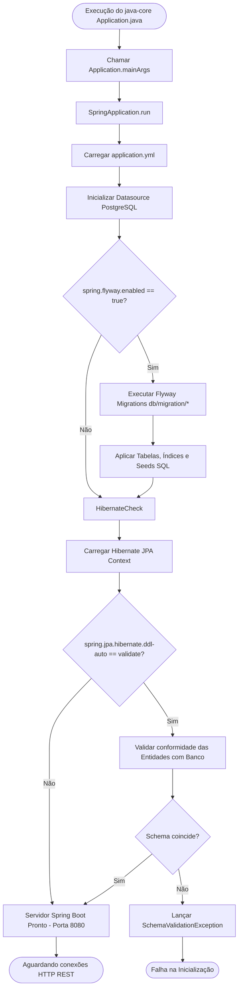

# Fluxograma de Controle: java-core 🟢 **CONFIRMADO**

Este fluxograma ilustra o ciclo de inicialização do Spring Boot e o processo automático de migração/validação do esquema do banco de dados (Flyway & Hibernate).

