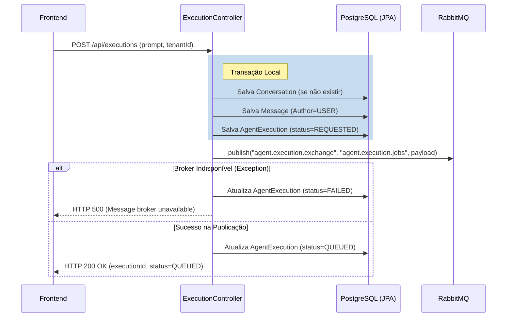

# Fluxogramas do Módulo: java-core

## Fluxo Assíncrono de Submissão de Execução Cognitiva (RAG / AI)

```mermaid
sequenceDiagram
    participant FE as Frontend
    participant EC as ExecutionController
    participant DB as PostgreSQL (JPA)
    participant MQ as RabbitMQ
    
    FE->>EC: POST /api/executions (prompt, tenantId)
    
    rect rgb(200, 220, 240)
        Note right of EC: Transação Local
        EC->>DB: Salva Conversation (se não existir)
        EC->>DB: Salva Message (Author=USER)
        EC->>DB: Salva AgentExecution (status=REQUESTED)
    end
    
    EC->>MQ: publish("agent.execution.exchange", "agent.execution.jobs", payload)
    
    alt Broker Indisponível (Exception)
        EC->>DB: Atualiza AgentExecution (status=FAILED)
        EC-->>FE: HTTP 500 (Message broker unavailable)
    else Sucesso na Publicação
        EC->>DB: Atualiza AgentExecution (status=QUEUED)
        EC-->>FE: HTTP 200 OK (executionId, status=QUEUED)
    end
```
