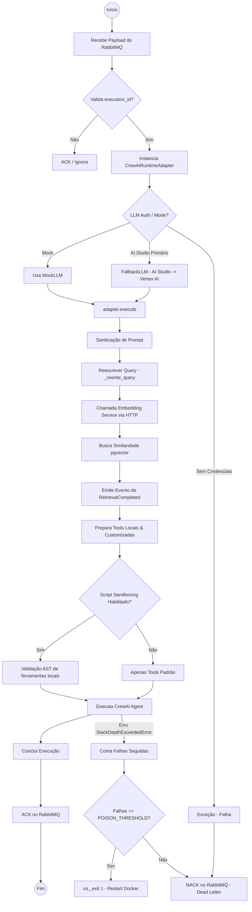

# Fluxograma: process_job & execute (CrewAiRuntimeAdapter)

```mermaid
graph TD
    Start((Início)) --> A[Recebe Payload do RabbitMQ]
    A --> B{Valida execution_id?}
    B -->|Não| C[ACK / Ignora]
    B -->|Sim| D[Instancia CrewAiRuntimeAdapter]
    
    D --> E{LLM Auth / Mode?}
    E -->|Mock| F[Usa MockLLM]
    E -->|AI Studio Primário| G[FallbackLLM - AI Studio -> Vertex AI]
    E -->|Sem Credenciais| H[Exceção - Falha]
    
    F --> I[adapter.execute]
    G --> I
    
    I --> J[Sanitização de Prompt]
    J --> K[Reescrever Query - _rewrite_query]
    K --> L[Chamada Embedding Service via HTTP]
    L --> M[Busca Similaridade pgvector]
    M --> N[Emite Evento de RetrievalCompleted]
    
    N --> O[Prepara Tools Locais & Customizadas]
    O --> P{Script Sandboxing Habilitado?}
    P -->|Sim| Q[Validação AST de ferramentas locais]
    P -->|Não| R[Apenas Tools Padrão]
    
    Q --> S[Executa CrewAI Agent]
    R --> S
    
    S --> T[Conclui Execução]
    T --> U[ACK no RabbitMQ]
    U --> V((Fim))
    
    H --> W[NACK no RabbitMQ - Dead Letter]
    S -->|Erro StackDepthExceededError| X[Conta Falhas Seguidas]
    X --> Y{Falhas >= POISON_THRESHOLD?}
    Y -->|Sim| Z[os._exit 1 - Restart Docker]
    Y -->|Não| W
```
