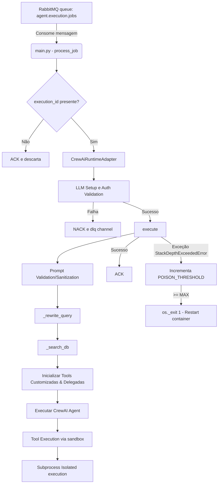

# Fluxogramas: python-services

## Visão Geral do Módulo

```mermaid
graph TD
    A[RabbitMQ queue: agent.execution.jobs] -->|Consome mensagem| B(main.py - process_job)
    B --> C{execution_id presente?}
    C -->|Não| D[ACK e descarta]
    C -->|Sim| E[CrewAiRuntimeAdapter]
    E --> F[LLM Setup e Auth Validation]
    F -->|Falha| G[NACK e dlq channel]
    F -->|Sucesso| H[execute]
    
    H --> I[Prompt Validation/Sanitization]
    I --> J[_rewrite_query]
    J --> K[_search_db]
    K --> L[Inicializar Tools Customizadas & Delegadas]
    L --> M[Executar CrewAI Agent]
    
    M --> N[Tool Execution via sandbox]
    N --> O[Subprocess Isolated execution]
    
    H -->|Sucesso| P[ACK]
    H -->|Exceção StackDepthExceededError| Q[Incrementa POISON_THRESHOLD]
    Q -->|>= MAX| R[os._exit 1 - Restart container]
```
