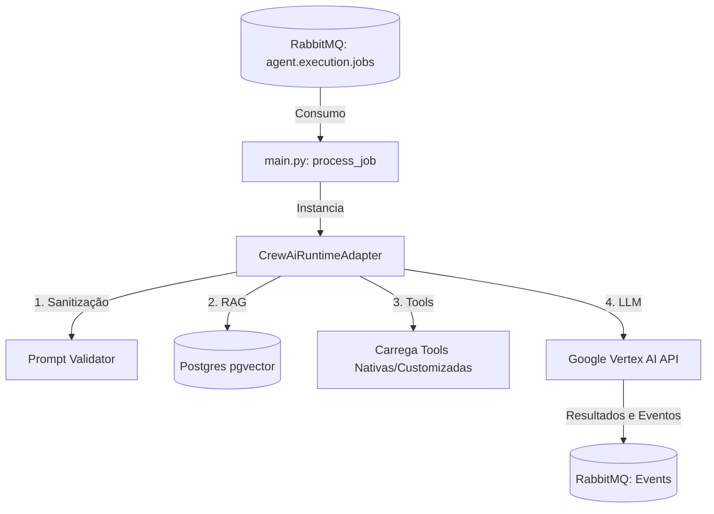

# Fluxogramas do Módulo: python-services

## Arquitetura Geral do Worker Python (CrewAI)

```mermaid
graph TD
    MQ[(RabbitMQ: agent.execution.jobs)] --> |Consumo| W[main.py: process_job]
    W --> |Instancia| A[CrewAiRuntimeAdapter]
    A --> |1. Sanitização| S[Prompt Validator]
    A --> |2. RAG| DB[(Postgres pgvector)]
    A --> |3. Tools| T[Carrega Tools Nativas/Customizadas]
    A --> |4. LLM| Vertex[Google Vertex AI API]
    Vertex --> |Resultados e Eventos| E[(RabbitMQ: Events)]
```
