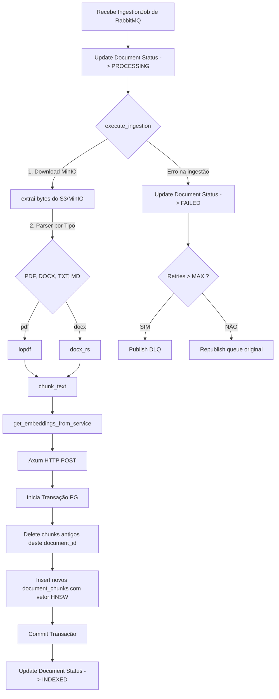

# Fluxograma: rust-services - ingestion-worker (process_delivery)

```mermaid
graph TD
    A[Recebe IngestionJob de RabbitMQ] --> B[Update Document Status -> PROCESSING]
    B --> C{execute_ingestion}
    
    C -->|1. Download MinIO| D[extrai bytes do S3/MinIO]
    D -->|2. Parser por Tipo| E{PDF, DOCX, TXT, MD}
    E -->|pdf| F[lopdf]
    E -->|docx| G[docx_rs]
    
    F --> H[chunk_text]
    G --> H
    
    H --> I[get_embeddings_from_service]
    I --> J[Axum HTTP POST]
    
    J --> K[Inicia Transação PG]
    K --> L[Delete chunks antigos deste document_id]
    L --> M[Insert novos document_chunks com vetor HNSW]
    M --> N[Commit Transação]
    
    N --> O[Update Document Status -> INDEXED]
    
    C -- Erro na ingestão --> P[Update Document Status -> FAILED]
    P --> Q{Retries > MAX ?}
    Q -- SIM --> R[Publish DLQ]
    Q -- NÃO --> S[Republish queue original]
```
