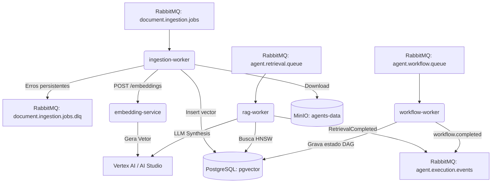

# Fluxograma: rust-services

```mermaid
graph TD
    %% Queues
    Q_IN[RabbitMQ: document.ingestion.jobs]
    Q_RAG[RabbitMQ: agent.retrieval.queue]
    Q_WF[RabbitMQ: agent.workflow.queue]
    Q_EVT[RabbitMQ: agent.execution.events]
    Q_DLQ[RabbitMQ: document.ingestion.jobs.dlq]

    %% Workers
    IW(ingestion-worker)
    RW(rag-worker)
    WW(workflow-worker)
    ES(embedding-service)
    
    %% APIs / Bancos Externos
    M[(MinIO: agents-data)]
    PG[(PostgreSQL: pgvector)]
    GCP[Vertex AI / AI Studio]

    Q_IN --> IW
    IW -->|Download| M
    IW -->|POST /embeddings| ES
    ES -->|Gera Vetor| GCP
    IW -->|Insert vector| PG
    IW -->|Erros persistentes| Q_DLQ

    Q_RAG --> RW
    RW -->|Busca HNSW| PG
    RW -->|LLM Synthesis| GCP
    RW -->|RetrievalCompleted| Q_EVT

    Q_WF --> WW
    WW -->|Grava estado DAG| PG
    WW -->|workflow.completed| Q_EVT
```
