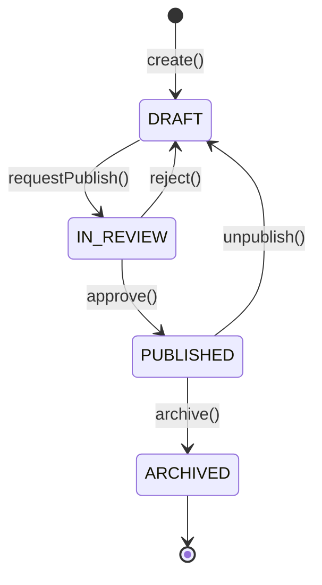
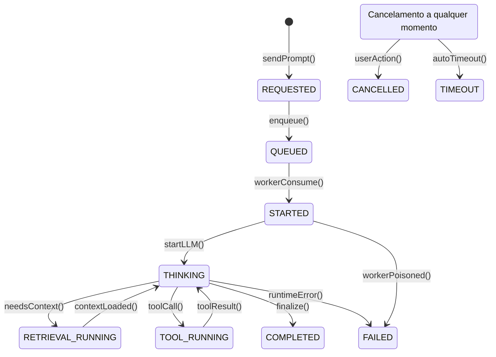
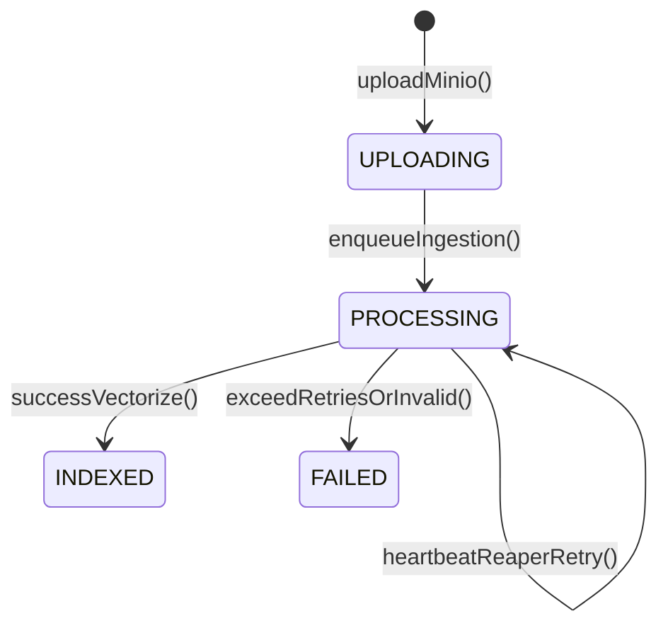

# Máquinas de Estado

## 1. Agent Status (Agente)
Entidade: `Agent`

| Status | Gatilho para transição |
|--------|------------------------|
| `DRAFT` | Criação inicial do pacote pelo usuário |
| `IN_REVIEW` | Solicitação de publicação para revisão |
| `PUBLISHED` | Aprovação do agente |
| `ARCHIVED` | Ação de arquivar pelo usuário ou descontinuação |

## 2. Agent Execution Status (Execução)
Entidade: `AgentExecution`

| Status | Gatilho para transição |
|--------|------------------------|
| `REQUESTED` | Requisição feita no Frontend |
| `QUEUED` | Salvo no banco de dados e colocado na fila do RabbitMQ |
| `STARTED` | `Crew-worker` aceita o job e emite evento Started |
| `THINKING` | LLM está formulando a resposta principal |
| `RETRIEVAL_RUNNING` | Disparo de evento `RetrievalStarted` (Busca Semântica no Rust) |
| `TOOL_RUNNING` | Disparo de evento `ToolCallStarted` (Sandbox Python rodando) |
| `COMPLETED` | Tarefa finalizada com sucesso, evento `AgentExecutionCompleted` |
| `FAILED` | Erro emitido pelo worker ou timeout, capturado por `AgentExecutionEventListener` |
| `CANCELLED` | Cancelado via API antes do término |
| `TIMEOUT` | Estourou tempo limite de execução |

## 3. Document Status (Documento)
Entidade: `Document`

| Status | Gatilho para transição |
|--------|------------------------|
| `UPLOADING` | Recebimento via multipart-form no Java Core e upload para o MinIO |
| `PROCESSING` | Job enfileirado `document.ingestion.jobs` recebido pelo `ingestion-worker` |
| `INDEXED` | Texto processado, chunking e embeddings inseridos no `pgvector` |
| `FAILED` | Erro crítico no parse, rejeição por Magic Bytes/JavaScript, ou falha pós retries de DLQ |

## 4. Tool Call Status
Entidade: `ToolCall`

| Status | Gatilho para transição |
|--------|------------------------|
| `STARTED` | Disparo do evento `ToolCallStarted` via RabbitMQ |
| `COMPLETED` | O subprocesso encerrou normalmente (código 0) e emitiu `ToolCallFinished` |
| `FAILED` | O subprocesso falhou (código de erro) ou foi morto (excesso de tempo/uso) |
