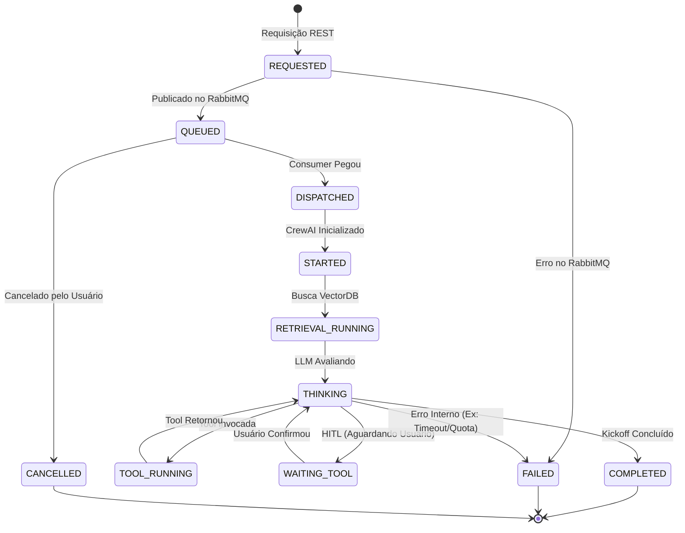

# Máquinas de Estado

> Gerado automaticamente pelo `reversa-detective`

## Entidade: AgentExecution

O ciclo de vida de processamento assíncrono de tarefas LLM trafegadas via RabbitMQ.

```mermaid
stateDiagram-v2
    [*] --> REQUESTED: Requisição REST
    REQUESTED --> QUEUED: Publicado no RabbitMQ
    REQUESTED --> FAILED: Erro no RabbitMQ
    
    QUEUED --> DISPATCHED: Consumer Pegou
    DISPATCHED --> STARTED: CrewAI Inicializado
    STARTED --> RETRIEVAL_RUNNING: Busca VectorDB
    RETRIEVAL_RUNNING --> THINKING: LLM Avaliando
    
    THINKING --> TOOL_RUNNING: Tool Invocada
    TOOL_RUNNING --> THINKING: Tool Retornou
    
    THINKING --> WAITING_TOOL: HITL (Aguardando Usuário)
    WAITING_TOOL --> THINKING: Usuário Confirmou
    
    THINKING --> COMPLETED: Kickoff Concluído
    THINKING --> FAILED: Erro Interno (Ex: Timeout/Quota)
    
    QUEUED --> CANCELLED: Cancelado pelo Usuário
    
    COMPLETED --> [*]
    FAILED --> [*]
    CANCELLED --> [*]
```
