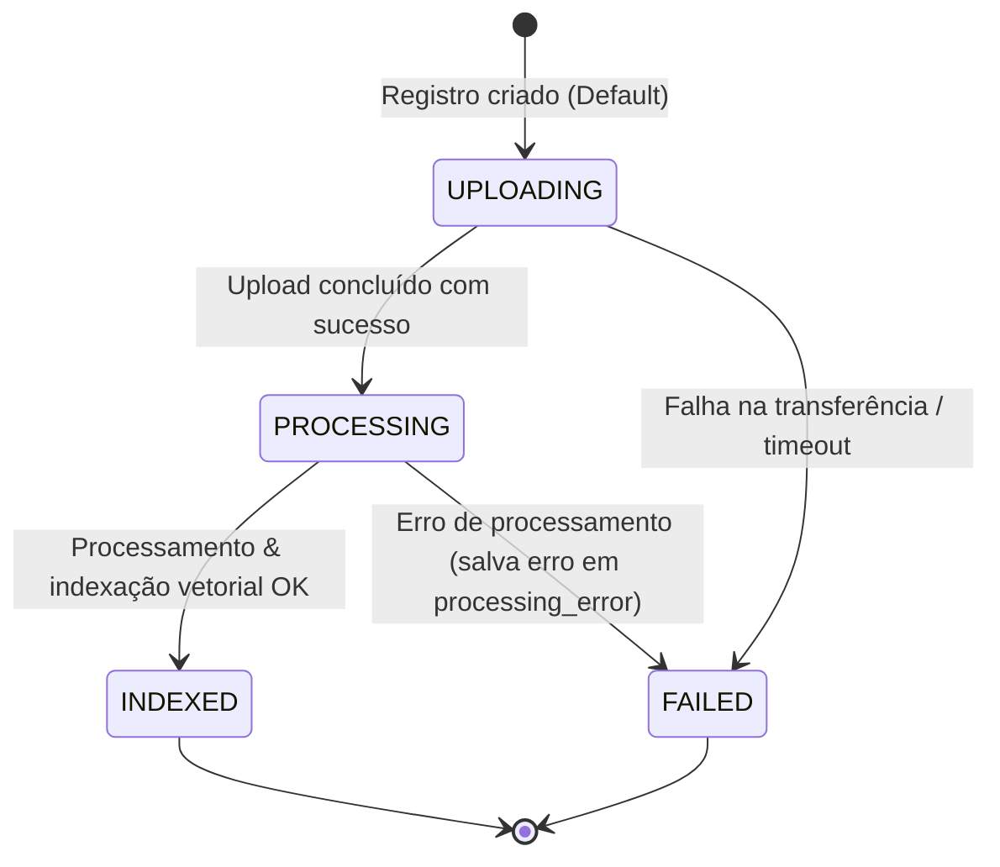
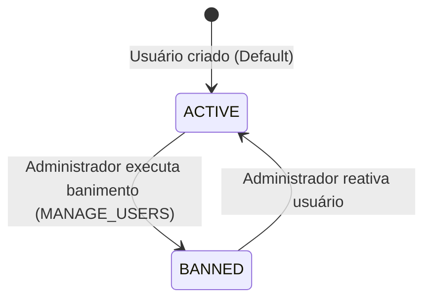

# Máquinas de Estado

Documento gerado pelo agente **Detective** para mapear os ciclos de vida e as transições de estado das principais entidades do sistema.

---

## 1. Ciclo de Vida do Documento (`documents.status`)

A entidade `documents` possui uma máquina de estados estrita que acompanha o arquivo desde o envio inicial até a indexação final no banco de dados vetorial.

### 1.1. Estados Definidos
* **`UPLOADING` (Estado Inicial):** O documento foi registrado no banco e o arquivo físico/binário está sendo carregado no repositório de arquivos (S3/MinIO).
* **`PROCESSING`:** O upload foi concluído com sucesso e o arquivo foi enviado para o pipeline de processamento (extração de texto, chunking e geração de embeddings).
* **`INDEXED` (Estado Final de Sucesso):** O documento foi completamente processado, seus chunks foram gerados e armazenados com seus respectivos embeddings na tabela `document_chunks`. O documento está agora disponível para buscas semânticas (RAG).
* **`FAILED` (Estado Final de Erro):** Ocorreu um erro em qualquer uma das etapas (upload, extração de texto ou geração de embeddings). O erro detalhado é persistido no campo `processing_error`.

### 1.2. Tabela de Transições

| Estado de Origem | Ação / Gatilho | Estado de Destino | Tipo de Transição | Confiança |
|------------------|----------------|-------------------|-------------------|-----------|
| *(Nenhum)* | Criação do registro no banco | `UPLOADING` | Automática (Default SQL) | 🟢 CONFIRMADO |
| `UPLOADING` | Upload do arquivo concluído com sucesso | `PROCESSING` | Sistêmica | 🟡 INFERIDO |
| `UPLOADING` | Falha na transferência ou timeout | `FAILED` | Sistêmica / Exceção | 🟡 INFERIDO |
| `PROCESSING` | Extração e geração de embeddings concluídas | `INDEXED` | Sistêmica | 🟢 CONFIRMADO |
| `PROCESSING` | Falha ao extrair texto, erro na API de embeddings ou falha na escrita do banco | `FAILED` | Sistêmica / Exceção | 🟢 CONFIRMADO |

### 1.3. Diagrama Mermaid

---

## 2. Ciclo de Vida do Usuário (`users.status`)

A entidade `users` gerencia a atividade de acesso dos operadores e administradores ao sistema.

### 2.1. Estados Definidos
* **`ACTIVE` (Estado Inicial):** Usuário registrado com sucesso e apto a fazer login e interagir com o sistema conforme seu papel.
* **`INACTIVE` / `BANNED`:** Usuário desativado ou banido administrativamente, bloqueando qualquer tentativa de login ou requisição autenticada.

### 2.2. Tabela de Transições

| Estado de Origem | Ação / Gatilho | Estado de Destino | Tipo de Transição | Confiança |
|------------------|----------------|-------------------|-------------------|-----------|
| *(Nenhum)* | Criação do usuário | `ACTIVE` | Automática (Default SQL) | 🟢 CONFIRMADO |
| `ACTIVE` | Administrador desativa/bane o usuário | `INACTIVE` / `BANNED` | Ação de Admin (`MANAGE_USERS`) | 🟡 INFERIDO |
| `INACTIVE` / `BANNED` | Administrador reativa o usuário | `ACTIVE` | Ação de Admin (`MANAGE_USERS`) | 🟡 INFERIDO |

### 2.3. Diagrama Mermaid

